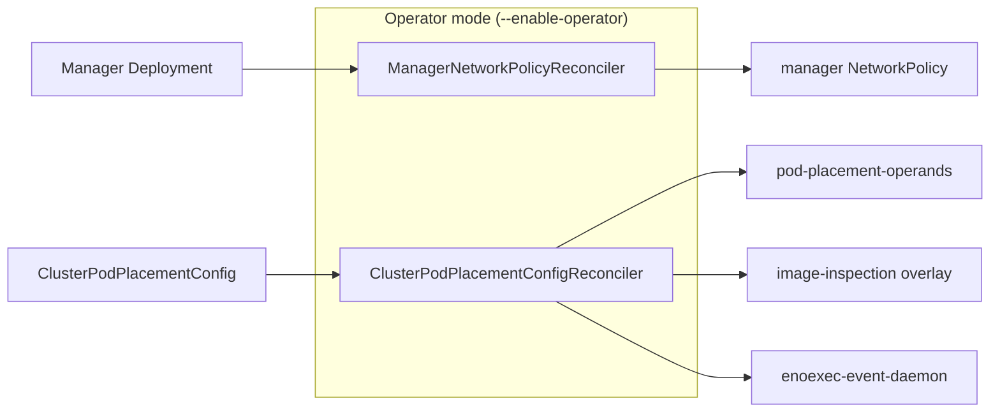

# NetworkPolicy Hardening for MTO Workloads

## Release Signoff Checklist

- [x] Enhancement is `implementable`
- [x] Design details are appropriately documented from clear requirements
- [x] Test plan is defined
- [ ] Graduation criteria for dev preview, tech preview, GA
- [ ] User-facing documentation is created in [openshift-docs](https://github.com/openshift/openshift-docs/)

## Summary

Add additive `networking.k8s.io/v1` NetworkPolicy resources for all Multiarch Tuning Operator
workloads on supported OpenShift deployments, including HyperShift (HCP). The policies are created
at runtime by the operator itself, not shipped as static OLM bundle manifests, so they work across
OCP 4.16–5.x without depending on OLM NetworkPolicy support.

Each MTO-managed workload receives a label-scoped policy following the established OpenShift
operator convention: hardcoded platform peers (`openshift-dns`, `openshift-monitoring`),
destination-less port rules for host-networked or topology-variable services (API server, webhooks),
and intentionally open TCP egress for image-registry inspection.

## Motivation

HPSTRAT-104 requires OpenShift operators to ship NetworkPolicy coverage for their own workloads.
MTO currently has none. A static YAML in the OLM bundle would fail Enterprise Contract
(`olm.allowed_resource_kinds: NetworkPolicy`) and would not be managed correctly by OLM on
OCP 4.16–4.19. Runtime reconciliation is the approach that satisfies both the hardening mandate
and the older OLM constraint.

### User Stories

- As a cluster administrator, I want the Multiarch Tuning Operator's workloads to be protected by
  NetworkPolicy so that HPSTRAT-104 network hardening requirements are satisfied without manual
  policy authoring.
- As a HyperShift administrator, I want MTO's NetworkPolicies to use destination-less port rules
  for API and webhook traffic so that policies do not break on topologies where the API server is
  not represented by guest cluster pods.
- As an operator consumer on OCP 4.16, I want NetworkPolicy protection without requiring OLM
  bundle support for `NetworkPolicy` manifests, which is not available until the OLM backport lands.

### Goals

- Protect every MTO-managed workload (manager, pod-placement controller, pod-placement webhook,
  ENoExec event handler, ENoExec daemon) with a label-scoped `NetworkPolicy`.
- Follow the established OpenShift operator convention for peer encoding:
  - DNS egress: namespace selector `kubernetes.io/metadata.name=openshift-dns`, TCP+UDP 5353
  - API egress: destination-less TCP 6443
  - Metrics ingress: namespace selector `kubernetes.io/metadata.name=openshift-monitoring`, TCP 8443
  - Webhook ingress: destination-less TCP 9443
  - Registry / image-inspection egress: destination-less TCP (all ports)
- Create all policies at runtime so the operator works on OCP 4.16+ without depending on OLM
  `NetworkPolicy` bundle support.
- Provide self-healing for the manager policy (recreation on deletion) and lifecycle-bound operand
  policies (created and deleted with the `ClusterPodPlacementConfig` operands).
- Add the `networking.k8s.io/networkpolicies` RBAC permission to a namespace-scoped Role (for
  operator-local resources) and include it in the CSV's `permissions`, so the Enterprise Contract
  `olm.required_network_policy_rbac_for_operands` check passes. Cluster-scoped resources remain
  in the existing ClusterRole.

### Non-Goals

- No namespace-wide or default-deny policy. The policies are additive; administrators can layer
  their own deny rules on top. `PolicyTypes: [Ingress, Egress]` already isolate unmatched traffic
  on the selected pods, so a separate empty deny-all object is not required.
- No `ClusterPodPlacementConfig` fields for DNS, API, registry, proxy, or CIDR configuration.
  A generic networking configuration API belongs in MULTIARCH-5324.
- No registry FQDN/CIDR allow-list. Image inspection contacts arbitrary registries and CDN
  endpoints; destination-less TCP on all ports for the image-inspection workload is intentional.
- No static `NetworkPolicy` manifest in the OLM bundle. The Enterprise Contract
  `olm.allowed_resource_kinds` rule currently blocks this, and pre-4.20 OLM does not manage
  `NetworkPolicy` lifecycle correctly.
- No promise of non-OpenShift support. Generic Kubernetes support is tracked in MULTIARCH-5324.
- No health-probe ingress rule (TCP 8081). Kubelet probes are host-networked and are not filtered
  by NetworkPolicy.
- No `policy-group.network.openshift.io/host-network` peer. Nothing in the current MTO workloads
  needs ingress from host-network pods besides kubelet probes, which already bypass NetworkPolicy.

## Proposal

Four runtime `NetworkPolicy` objects, one per workload selector. Operand policies are applied by
the existing `ClusterPodPlacementConfigReconciler`. The manager policy is applied by a dedicated
`ManagerNetworkPolicyReconciler` because the manager Deployment exists before any
`ClusterPodPlacementConfig` is created.

### Policy Coverage

#### 1. Pod-placement operands (`pod-placement-operands`)

- **Selector:** `multiarch.openshift.io/operand: pod-placement-controller`
- **PolicyTypes:** Ingress, Egress
- **Ingress:**
  - Metrics: from `openshift-monitoring` namespace, TCP 8443
  - Webhook: destination-less TCP 9443 (HCP-safe)
- **Egress:**
  - DNS: to `openshift-dns` namespace, TCP+UDP 5353
  - API: destination-less TCP 6443

This policy covers the pod-placement controller, pod-placement webhook, and ENoExec event handler
Deployments, which share the operand label.

#### 2. Pod-placement image inspection (`pod-placement-controller-image-inspection`)

- **Selector:** `multiarch.openshift.io/operand: pod-placement-controller` AND
  `controller: pod-placement-controller`
- **PolicyTypes:** Egress
- **Egress:** destination-less TCP, all ports (registries, CDN endpoints, mirrors, proxies —
  addresses are dynamic and unknowable at policy-authoring time)

This overlay applies only to the pod-placement controller, which is the only operand that inspects
container images.

#### 3. ENoExec daemon (`enoexec-event-daemon`)

- **Selector:** `app: enoexec-event-daemon`
- **PolicyTypes:** Egress
- **Egress:**
  - DNS: to `openshift-dns` namespace, TCP+UDP 5353
  - API: destination-less TCP 6443

#### 4. Manager (`multiarch-tuning-operator-controller-manager`)

- **Selector:** `control-plane: controller-manager`
- **PolicyTypes:** Ingress, Egress
- **Ingress:**
  - Metrics: from `openshift-monitoring` namespace, TCP 8443
  - Webhook: destination-less TCP 9443
- **Egress:**
  - DNS: to `openshift-dns` namespace, TCP+UDP 5353
  - API: destination-less TCP 6443

### Architecture

#### Operand policies (1–3)

Created by the existing `ClusterPodPlacementConfigReconciler` alongside other operand resources
(Deployments, DaemonSets, Services, RBAC). Policies are added to the desired-objects list and
applied via `utils.ApplyResources()`, which has a `*networkingv1.NetworkPolicy` case using
`resourceapply.ApplyNetworkPolicy` from library-go.

Self-healing is provided by `Owns(&networkingv1.NetworkPolicy{})` in the controller's
`SetupWithManager`. Cleanup uses the existing operand deletion lists, which include
`NetworkPolicy` entries.

#### Manager policy (4)

Created by a dedicated `ManagerNetworkPolicyReconciler` that:

1. Watches the manager `Deployment` (filtered by name and namespace predicate).
2. Owns the manager `NetworkPolicy`.
3. Uses `controllerutil.CreateOrUpdate` with `ctrl.SetControllerReference` to set the Deployment
   as the policy's controller owner.
4. Recreates the policy if deleted (via `Owns()`).
5. Garbage-collects the policy when the Deployment is removed.

The manager policy cannot live on the CPPC reconciler because the manager Deployment exists
before any `ClusterPodPlacementConfig` is created.

#### Cache scoping

The RBAC split between ClusterRole (cluster-scoped resources) and a namespace-scoped Role
(operator-local resources) requires a matching cache boundary. Without it, controller-runtime
creates cluster-wide informers for types the Role only permits in the operator namespace,
causing `Forbidden` errors on list/watch requests and preventing cache synchronization.

`internal/controller/operator/cache.go` provides two functions:

- `CacheByObject()` — returns a `map[client.Object]cache.ByObject` scoping Deployment,
  DaemonSet, Service, ServiceAccount, NetworkPolicy, Role, and RoleBinding to
  `utils.Namespace()`. PodPlacementConfig and Pod are intentionally excluded: the
  pod-placement controller watches pending Pods cluster-wide, and PPC can exist in any
  namespace.

- `AddMonitoringCache(byObject)` — conditionally adds ServiceMonitor and PrometheusRule
  scoping when those CRDs exist on the cluster, gated by `utils.IsResourceAvailable()`.
  This avoids creating informers for types that may not be installed.

`cmd/main.go` calls `operator.CacheByObject()` in the `enableOperator` block before creating
the manager, then conditionally calls `operator.AddMonitoringCache()` after checking CRD
availability:

    if enableOperator {
        cacheOpts.ByObject = operator.CacheByObject()
    }
    // ...
    if enableOperator {
        dynClient := dynamic.NewForConfigOrDie(restConfig)
        if utils.IsResourceAvailable(ctx, dynClient,
            monitoringv1.SchemeGroupVersion.WithResource("servicemonitors")) {
            operator.AddMonitoringCache(cacheOpts.ByObject)
        }
    }

**Known risk:** `utils.IsResourceAvailable` caches transient API errors as permanent resource
absence. If the monitoring API is temporarily unreachable at startup, ServiceMonitor and
PrometheusRule watches are permanently skipped. This is a pre-existing bug tracked in
[MULTIARCH-6361](https://redhat.atlassian.net/browse/MULTIARCH-6361).



### Peer Encoding Rationale

| Flow | Encoding | Rationale |
|------|----------|-----------|
| DNS egress | `openshift-dns` namespace selector, TCP+UDP 5353 | OpenShift CoreDNS listens on 5353 (not 53). cluster-storage-operator and cluster-olm-operator use this pattern. The pod label `dns.operator.openshift.io/daemonset-dns` was dropped by cluster-olm-operator because it is not guaranteed on all topologies. |
| API egress | Destination-less TCP 6443 | The API server is host-networked; its address varies by topology. On HCP the API server is not in the guest cluster. console-operator and cluster-storage-operator rejected ClusterIP-as-peer in favor of this pattern. Tighter than the unrestricted `egress: [{}]` some guidance documents allow. |
| Metrics ingress | `openshift-monitoring` namespace selector, TCP 8443 | Standard OpenShift operator convention used by console-operator, cluster-storage-operator, and cluster-olm-operator, including on HCP. Tighter than a port-only rule. |
| Webhook ingress | Destination-less TCP 9443 | Same HCP / host-network reasoning as API egress. The API server calls the webhook from outside the cluster network on HCP. |
| Health probes | Not included | Kubelet probes come from the host network and are not subject to NetworkPolicy. samples-operator documents this explicitly. |
| Image inspection | Destination-less TCP, all ports | Registries, CDN endpoints, mirrors, and proxies use arbitrary addresses and ports. Standard NetworkPolicy cannot express an FQDN allow-list. |

## Design Details

### Changes to the Operator

#### New files

- `internal/controller/operator/networkpolicy.go` — policy builders and shared helpers (DNS, API,
  metrics, webhook, image-inspection rules)
- `internal/controller/operator/manager_networkpolicy_controller.go` — `ManagerNetworkPolicyReconciler`
- `internal/controller/operator/networkpolicy_test.go` — unit tests for all policy builders
- `internal/controller/operator/manager_networkpolicy_controller_test.go` — envtest for the manager
  policy reconciler
- `internal/controller/operator/cache.go` — `CacheByObject()` and `AddMonitoringCache()` for
  per-type namespace scoping of controller-runtime informers
- `internal/controller/operator/cache_test.go` — unit tests for cache scoping
- `config/rbac/manager_networkpolicy_rolebinding.yaml` — RoleBinding for the namespace-scoped Role
- `pkg/testing/framework/networkpolicy.go` — test framework helpers
- `pkg/testing/builder/networkpolicy.go` — test builder helpers

#### Modified files

- `internal/controller/operator/clusterpodplacementconfig_controller.go` — RBAC marker
  (`namespace=system`), operand policies on the desired-objects and delete-ref lists,
  `Owns(&networkingv1.NetworkPolicy{})`
- `cmd/main.go` — register `ManagerNetworkPolicyReconciler` in `RunOperator()`, call
  `operator.CacheByObject()` and conditionally `operator.AddMonitoringCache()` in the
  `enableOperator` block
- `pkg/utils/const.go` — policy name constants, DNS/monitoring namespace constants
- `pkg/utils/resource.go` — `*networkingv1.NetworkPolicy` case in `ApplyResource()`
- `config/rbac/role.yaml` — split into ClusterRole (cluster-scoped) + Role (namespace-scoped)
- `config/rbac/kustomization.yaml` — includes the new RoleBinding
- `bundle/manifests/*.clusterserviceversion.yaml` — regenerated CSV with `networking.k8s.io`
  RBAC in both `clusterPermissions` and `permissions`

### RBAC Changes

The operator uses a split RBAC model for least-privilege:

**ClusterRole** (`config/rbac/role.yaml`, `kind: ClusterRole`) retains permissions for
cluster-scoped and intentionally cross-namespace resources: `ClusterPodPlacementConfig`,
`PodPlacementConfig`, Pods, Nodes, Namespaces, MutatingWebhookConfigurations,
ClusterRoles, ClusterRoleBindings, and SecurityContextConstraints.

**Namespace-scoped Role** (`config/rbac/role.yaml`, `kind: Role`, `namespace: system`)
holds permissions for operator-local namespaced resources:

```yaml
- apiGroups:
    - networking.k8s.io
  resources:
    - networkpolicies
  verbs:
    - create
    - delete
    - get
    - list
    - patch
    - update
    - watch
```

Along with Deployments, DaemonSets, Services, ServiceAccounts, Roles, RoleBindings,
and monitoring resources (ServiceMonitor, PrometheusRule).

A `RoleBinding` (`config/rbac/manager_networkpolicy_rolebinding.yaml`) binds the Role to
the controller-manager ServiceAccount in the operator namespace.

The kubebuilder marker uses `namespace=system` (the kustomize placeholder rewritten to the
install namespace at deploy time):

```text
//+kubebuilder:rbac:groups=networking.k8s.io,resources=networkpolicies,verbs=create;delete;get;list;patch;update;watch,namespace=system
```

The `namespace=system` marker appears in both `clusterpodplacementconfig_controller.go` and
`manager_networkpolicy_controller.go`. kubebuilder deduplicates the generated role entry.

The generated CSV includes `networking.k8s.io` permissions in the `permissions` section
(namespace-scoped), not in `clusterPermissions`.

**Important:** The cache must be scoped to match this RBAC boundary — see the Cache Scoping
section above. Without per-type namespace scoping in `cache.ByObject`, controller-runtime
creates cluster-wide informers that the namespace-scoped Role cannot authorize.

### Risks and Mitigations

| Risk | Mitigation |
|------|------------|
| Additive policies with `PolicyTypes: [Ingress, Egress]` create implicit deny for unmatched traffic on selected pods | Document that the policies are additive but do impose egress restrictions. Ensure all required egress paths (DNS, API, registry) are explicitly allowed. |
| DNS pod label (`dns.operator.openshift.io/daemonset-dns`) is not present on all topologies | Use a namespace-only selector for DNS, consistent with cluster-olm-operator. |
| Proxy-aware image inspection may use non-443 ports (3128, 8080) | The image-inspection policy uses destination-less TCP on all ports, not just 443. |
| envtest garbage collection does not run kube-controller-manager | Explicitly delete both the manager Deployment and NetworkPolicy in AfterEach; wait for both to be confirmed absent. |
| `IsResourceAvailable` caches transient errors as permanent resource absence | Pre-existing bug on `main` tracked in [MULTIARCH-6361](https://redhat.atlassian.net/browse/MULTIARCH-6361). Monitoring CRD discovery at startup can permanently skip ServiceMonitor/PrometheusRule if the API is temporarily unreachable. |

### Drawbacks

- Runtime creation adds a dedicated controller registration compared to a static bundle manifest.
- The manager policy reconciler is a permanent fixture until OLM NetworkPolicy support is
  backported and the EC rule is lifted, at which point the operator could migrate to a static
  bundle manifest.

### Open Questions

None remaining. The following were resolved during implementation:

1. Health-probe ingress (TCP 8081) is omitted. Kubelet probes are host-networked and are not
   filtered by NetworkPolicy.
2. The manager policy uses a dedicated reconciler (`ManagerNetworkPolicyReconciler`) rather than
   a one-shot `CreateOrUpdate` at startup, so the policy self-heals if deleted while the operator
   is running.
3. Implicit deny from `PolicyTypes: [Ingress, Egress]` on the allow policies is sufficient. A
   separate label-scoped default-deny object would not change the allow set while MTO owns the
   full rule list.

### Test Plan

#### Unit tests

- Assert exact selectors, port numbers, protocols, peer shapes (namespace selectors,
  destination-less rules), and `PolicyTypes` for each of the four policy builders.
- Assert no `IPBlock` rules (no hardcoded CIDRs).
- Assert image-inspection egress is only on the image-inspection policy.
- Assert health-probe ingress (TCP 8081) is not listed.
- Assert `config/default/kustomization.yaml` does not include `../network` (no static bundle
  NetworkPolicy).

#### Integration tests (envtest)

- Manager policy: create Deployment → verify NetworkPolicy is created; delete NetworkPolicy →
  verify it is recreated.
- Operand policies: create CPPC → verify operand NetworkPolicies are created; delete CPPC →
  verify operand NetworkPolicies are deleted.

#### Functional / E2E tests

- Verify DNS resolution, API access, webhook admission, metrics scraping, health probes, and
  image inspection remain functional with all policies installed on standalone OpenShift and HCP
  clusters.

### Graduation Criteria

This enhancement ships as part of MULTIARCH-5569. No alpha/beta graduation is needed: the policies
are additive and do not change existing behavior unless a namespace-wide deny policy is layered on
top by the administrator.

### Upgrade / Downgrade Strategy

#### Upgrade

- New policies are created on first reconciliation after upgrade.
- If a pre-existing CSV-owned NetworkPolicy exists from an earlier static-bundle approach, the
  manager reconciler detects the ownership conflict (different controller owner UID), deletes the
  stale policy, and recreates it with Deployment ownership.

#### Downgrade

- Operand policies are deleted when the CPPC is deleted (standard operand lifecycle).
- The manager policy is garbage-collected when the manager Deployment is removed by OLM during
  uninstall.
- If the operator is downgraded to a version without NetworkPolicy support, the policies become
  orphaned (no matching controller). They are harmless because they select pods by labels that the
  downgraded operator still uses. Administrators can delete them manually if needed.

### Operational Aspects of API Extensions

This enhancement does not introduce API extensions. No CRD changes, no new
`ClusterPodPlacementConfig` fields.

#### Failure Modes

- If the operator lacks `networking.k8s.io` RBAC, policy creation fails and the reconciler logs an
  error. The operator continues to function without NetworkPolicy protection.
- If `openshift-dns` or `openshift-monitoring` namespaces are absent (non-OpenShift cluster), the
  policies are still created but the namespace selectors match nothing. This is a no-op, not a
  failure.

## Documentation Plan

- Document the four policies, their selectors, and the peer-encoding rationale in the operator's
  user-facing documentation.
- Document that the policies are additive and do not implement a namespace-wide default-deny.
- Document the intentional open TCP egress for image inspection and the proxy-as-tightening-path
  option.
- Document that non-OpenShift support is out of scope (MULTIARCH-5324).

## Implementation History

- 2026-09-22: PR #558 — initial implementation with a static bundle manifest and runtime operand
  policies. EC violations identified.
- 2026-09-23: PR #560 — runtime reconciliation for all policies (no static bundle manifest).
  Addresses EC `olm.allowed_resource_kinds` violation.
- 2026-09-23: This enhancement document.

## Alternatives

### Static NetworkPolicy in the OLM bundle with an EC exception

Ship the manager `NetworkPolicy` as a YAML manifest in `bundle/manifests/` and request an
Enterprise Contract exception for `olm.allowed_resource_kinds`.

*Rejected because:* OLM on OCP 4.16–4.19 does not properly support `NetworkPolicy` as a bundle
manifest kind. The EC rule exists to protect those versions. VPA and CRO operators obtained
exceptions starting at 4.21 only.

### Startup-time CreateOrUpdate (no controller)

Create the manager `NetworkPolicy` once in `main.go` at operator startup using
`controllerutil.CreateOrUpdate`, with no reconciler or watches.

*Considered as a simpler alternative.* Repairs drift on pod restart but does not self-heal if the
policy is deleted while the operator is running. The full reconciler provides stronger guarantees.

### ClusterPodPlacementConfig networking configuration API

Add DNS, API, registry, proxy, and CIDR peer fields to `ClusterPodPlacementConfig` for a generic,
configurable policy model.

*Rejected because:* this overbuilds MULTIARCH-5569, which is an OpenShift security hardening
story. Image inspection cannot be expressed as a static registry allow-list. A generic
configuration API belongs in MULTIARCH-5324.

### ClusterIP / EndpointSlice discovery

Discover the `kubernetes.default` Service ClusterIP and DNS endpoint IPs at reconcile time, then
emit `ipBlock` rules.

*Rejected because:* established OpenShift operators (cluster-storage-operator, console-operator)
explicitly rejected ClusterIP-as-peer. The API server is host-networked; Service NAT behavior is
CNI-dependent. Destination-less port rules are the proven convention.
## Future Migration to OLM-Managed NetworkPolicies

### Context

The runtime reconciliation approach in this enhancement is necessary because
OLM does not support NetworkPolicy manifests in bundles on OCP < 4.20, and the
Conforma policy KONFLUX-9372 currently blocks NetworkPolicy in bundles across
all OCP versions as an interim measure. The OLM team is backporting
NetworkPolicy support to OCP 4.12 for OLMv0 and OCP 4.18 for OLMv1 (tracked
in OPRUN-4069).

### Migration trigger

MTO should migrate the manager NetworkPolicy from runtime reconciliation to a
static OLM bundle manifest when EITHER of the following conditions is met:

1. The OLM backport lands on all OCP versions that MTO actively supports AND
   the Conforma interim block (KONFLUX-9372) is lifted, OR
2. MTO drops support for OCP <= 4.19 from its active release branches.

### Migration plan

When the trigger condition is met:

1. Add the manager NetworkPolicy YAML to `config/network/` and include
   `- ../network` in `config/default/kustomization.yaml` (restoring the
   structure from the original PR #558 design).
2. Remove the `ManagerNetworkPolicyReconciler` controller, its registration
   in `RunOperator()`, and its envtest.
3. Add a migration check in the CPPC reconciler or a startup hook to detect
   and delete any runtime-owned manager NetworkPolicy left over from the
   previous approach, so OLM can take ownership cleanly.
4. Regenerate the bundle (`make manifests generate bundle`) and verify the
   NetworkPolicy appears in `bundle/manifests/`.
5. Verify the Conforma `olm.allowed_resource_kinds` check passes without an
   exception.

The operand NetworkPolicies (pod-placement, image-inspection, ENoExec daemon)
remain runtime-managed regardless of this migration, because the OLM guidance
states: "NetworkPolicies included in OLM bundles should only be used for the
operators installed by OLM. If NetworkPolicies are needed for operands, the
operators should manage these NetworkPolicies as OLM will not manage them."

### Tracking

This migration is not part of MULTIARCH-5569. File a follow-up story when the
trigger condition is met, linking to HPSTRAT-278 and OPRUN-4069.
## Infrastructure Needed

None. No new CI clusters, CRDs, or external services.

## References

- [MULTIARCH-5569](https://issues.redhat.com/browse/MULTIARCH-5569) — parent story
- [HPSTRAT-104](https://issues.redhat.com/browse/HPSTRAT-104) — network hardening dependency
- [HPSTRAT-278](https://issues.redhat.com/browse/HPSTRAT-278) — NetworkPolicy in OLM bundles
  mandate (Feb 2027)
- [MULTIARCH-5324](https://issues.redhat.com/browse/MULTIARCH-5324) — generic non-OpenShift
  support epic
